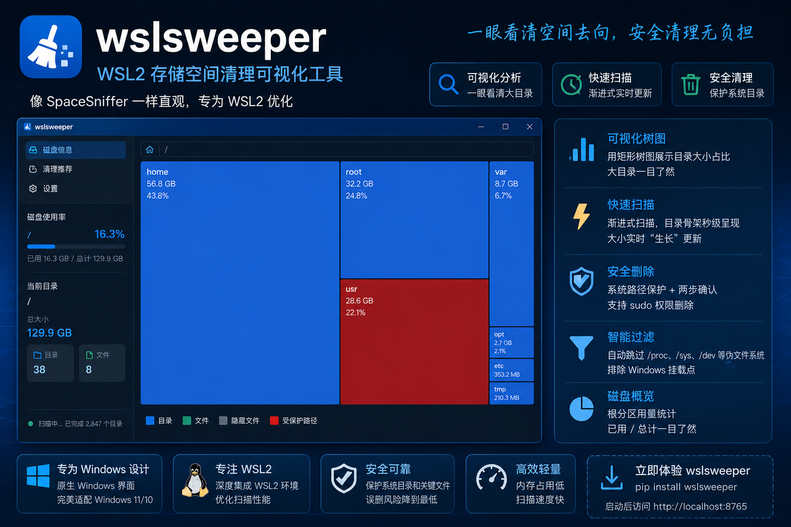

# 🧹 wslsweeper


WSL2 存储空间清理可视化工具，对标 Windows SpaceSniffer。支持渐进式扫描、TreeMap 可视化、智能清理推荐和安全删除。

## ✨ 功能特性

### 可视化分析
- 🗺️ **TreeMap 矩形树图** — 直观展示目录和文件的占用大小，大目录一目了然
- 🌈 **颜色编码** — 蓝色=目录、绿色=文件、灰色=隐藏文件、红色=受保护路径
- 📊 **大小渐变** — 颜色深浅反映占用比例，越大越深
- 💡 **悬停详情** — 鼠标悬停显示完整路径、大小、占比、权限、修改时间

### 扫描引擎
- ⚡ **SpaceSniffer 式渐进扫描** — 目录骨架毫秒级呈现，大小逐个"生长"出来
- 📦 **递归大小计算** — 目录递归计算总占用，实时更新 TreeMap 布局
- 🔄 **SSE 实时推送** — 后台计算完一个目录，前端立刻更新
- 💾 **内存缓存** — 5 分钟内重复访问毫秒级返回，不重复计算
- 🚫 **智能过滤** — 自动跳过 /proc、/sys、/dev 等伪文件系统，排除 /mnt Windows 挂载点

### 智能清理
- 🧠 **上下文感知** — 基于当前浏览目录，实时推荐可清理的大目录和陈旧目录
- 🌍 **全局缓存扫描** — 一次性扫描所有用户的 pip/npm/vscode-server/qoder-server 等缓存
- 📁 **node_modules 检测** — 自动发现所有超过 50MB 的 node_modules 目录
- ⏰ **时间感知** — 自动标记超过 4 个月未使用的缓存目录
- 🏷️ **类型标签** — 每个清理项带有类型标签和图标（🐍 pip、📦 npm、💻 VS Code 等）

### 安全删除
- 🔒 **系统路径保护** — /usr、/etc、/bin 等系统目录受保护，无法删除
- ✅ **两步确认** — 输入文件名确认 + HMAC 令牌验证（5 分钟有效）
- 🔑 **sudo 权限提升** — 普通用户删除 root 文件时，支持 sudo 密码提升权限
- 📝 **中文提示** — 所有错误和提示均为中文，小白友好

## 🚀 快速开始

### 安装

```bash
pip install wslsweeper
```

或从源码安装：

```bash
git clone https://github.com/JackWPP/wslsweeper.git
cd wslsweeper
pip install -e .
```

### 运行

```bash
wslsweeper
```

启动后自动打开浏览器访问 http://localhost:8765

CLI 参数：

```bash
wslsweeper --port 8765          # 自定义端口（默认 8765）
wslsweeper --host 0.0.0.0        # 监听地址（默认 127.0.0.1）
wslsweeper --no-browser          # 不自动打开浏览器
```

### 常见问题

**Q: 安装后提示 `wslsweeper: command not found`**

Linux/WSL 上 `pip install` 默认将命令行脚本安装到 `~/.local/bin`，但该目录可能不在系统 `PATH` 中。解决方法：

```bash
export PATH="$HOME/.local/bin:$PATH"
wslsweeper
```

也可以直接通过 Python 模块方式启动（无需配置 PATH）：

```bash
python -m wslsweeper
```

**Q: `pip install -e .` 提示 editable install 不支持**

请确保 pip 版本不低于 22.0（支持 PEP 660）：

```bash
pip install --upgrade pip
pip install -e .
```

## 🛠️ 开发

### 环境要求

- Python >= 3.9
- pip >= 22.0（支持 PEP 660 editable install）
- Node.js >= 18
- uv（Python 包管理，可选）

### 环境搭建

```bash
# 安装后端依赖
uv sync

# 安装前端依赖
cd frontend && npm install && cd ..

# 以开发模式运行（前后端分离）
uv run python -m wslsweeper --no-browser  # 启动后端
cd frontend && npm run dev                   # 启动前端（访问 http://localhost:5173）
```

### 构建

```bash
# 构建前端并部署到 static/
cd frontend && npm run build
cp -r frontend/dist/* src/wslsweeper/static/

# 或使用脚本
./scripts/build_frontend.sh
```

## 🏗️ 技术架构

### 后端（Python）

| 模块 | 作用 |
|------|------|
| `scanner.py` | 目录骨架扫描 + 递归大小计算 + SSE 生成器 |
| `safety.py` | 受保护路径判断 + HMAC 令牌 + sudo 权限检测 |
| `cache.py` | 内存 LRU 缓存（TTL 5 分钟） |
| `cleanup.py` | 全局缓存扫描 + 上下文清理推荐 |
| `api/router.py` | FastAPI 路由，7 个端点 |
| `cli.py` | CLI 入口 |

### 前端（React + TypeScript）

| 组件 | 作用 |
|------|------|
| `App.tsx` | 主应用，SSE 连接管理，布局 |
| `TreeMapCanvas.tsx` | D3.js TreeMap 核心，含动画过渡 |
| `BreadcrumbBar.tsx` | 路径导航面包屑 |
| `SidebarInfo.tsx` | 磁盘用量侧边栏 |
| `CleanupPanel.tsx` | 智能清理推荐面板（双区域） |
| `ConfirmDialog.tsx` | 删除确认弹窗（含 sudo 密码输入） |

### API 端点

| 端点 | 方法 | 说明 |
|------|------|------|
| `/api/scan` | GET | 阻塞式完整扫描（已缓存） |
| `/api/scan-progress` | GET | SSE 渐进扫描流 |
| `/api/disk` | GET | 根分区磁盘用量 |
| `/api/mounts` | GET | 所有挂载点（已过滤 /mnt） |
| `/api/validate` | GET | 删除验证（含 needs_sudo） |
| `/api/delete` | POST | 删除文件/目录（支持 sudo） |
| `/api/cleanup-suggestions` | GET | 全局缓存清理推荐 |
| `/api/context-cleanup` | GET | 当前目录上下文清理推荐 |

## 📋 项目结构

```
wslsweeper/
├── pyproject.toml              # Python 包配置（uv）
├── README.md
├── LICENSE (MIT)
├── uv.lock
├── scripts/
│   └── build_frontend.sh      # 一键构建脚本
├── src/wslsweeper/
│   ├── __init__.py
│   ├── __main__.py            # python -m wslsweeper 入口
│   ├── cli.py                  # wslsweeper CLI 命令
│   ├── server.py               # FastAPI app factory
│   ├── scanner.py              # 扫描引擎 + SSE 生成器
│   ├── safety.py              # 安全模块（受保护路径 + 令牌）
│   ├── cache.py               # LRU 内存缓存
│   ├── cleanup.py              # 智能清理推荐
│   ├── api/
│   │   ├── router.py          # 7 个 API 端点
│   │   └── schemas.py          # Pydantic 模型
│   └── static/                 # 前端构建产物（打包时包含）
├── frontend/
│   ├── package.json
│   ├── vite.config.ts
│   ├── tsconfig.json
│   └── src/
│       ├── main.tsx
│       ├── App.tsx
│       ├── api/client.ts
│       ├── types/index.ts
│       ├── utils/formatBytes.ts
│       ├── hooks/
│       ├── components/
│       │   ├── TreeMapCanvas.tsx
│       │   ├── BreadcrumbBar.tsx
│       │   ├── SidebarInfo.tsx
│       │   ├── CleanupPanel.tsx
│       │   └── ConfirmDialog.tsx
│       └── styles/global.css
└── tests/
```

## 📄 License

MIT
